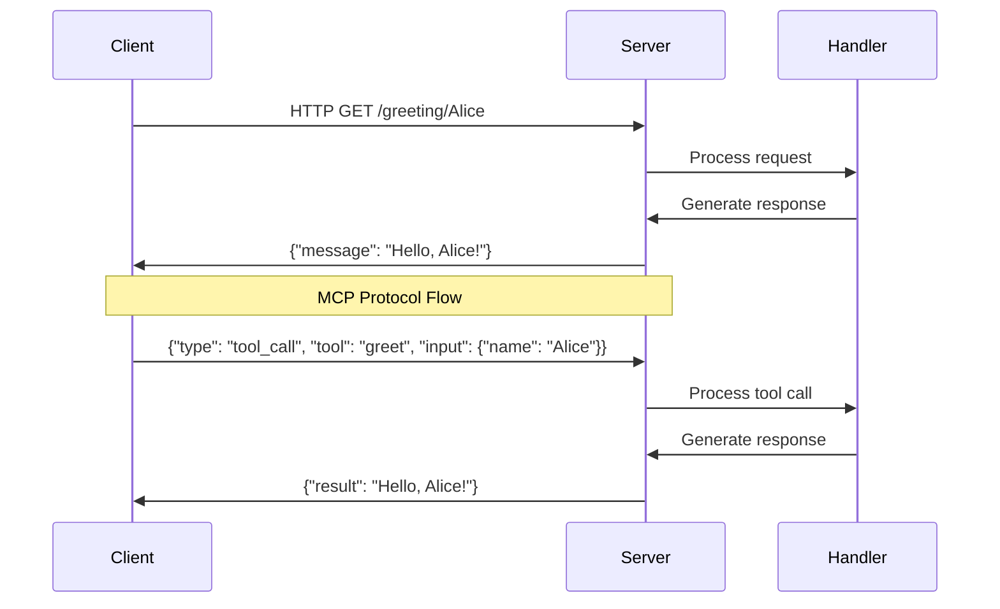
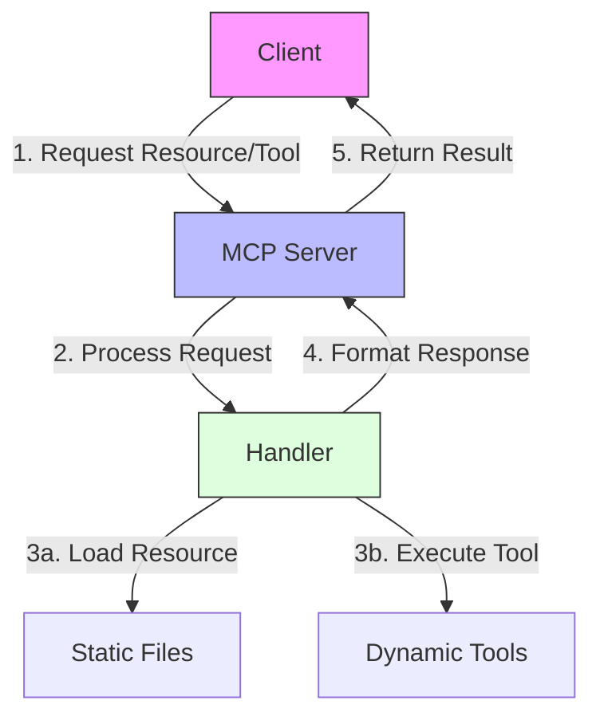
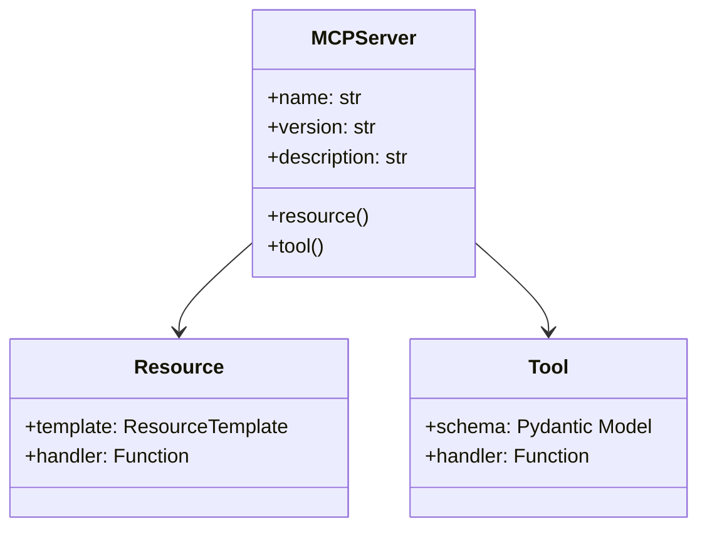

# Hello World MCP Server

This is a simple example demonstrating how to create an MCP (Model-Controller-Protocol) server using the common utilities.

## Features

- Simple implementation of an MCP server
- Demonstrates both tools and resources
- Supports both HTTP and stdio modes
- Includes generic client options

## Getting Started

### Running the Server

```bash
# HTTP mode (default)
python server.py

# stdio mode
python server.py --stdio

# Custom host/port
python server.py --host 127.0.0.1 --port 8080
```

### Running the Clients

#### HTTP Client

```bash
# Default settings (localhost:8000)
python client.py

# Custom server
python client.py --host 127.0.0.1 --port 8080
```

#### Stdio Client

```bash
# Start the server in stdio mode and interact with it
python stdio_client.py

# Use custom Python interpreter or server script
python stdio_client.py --python python3 --server path/to/server.py
```

### Using the Generic Client Directly

You can also use the generic client from the common utilities:

```python
from pepperpymcp import MCPClient, create_interactive_session

# HTTP client
client = MCPClient(host="localhost", port=8000)
create_interactive_session(client)

# Or for stdio mode
from pepperpymcp import MCPStdioClient
client = MCPStdioClient(["python", "server.py", "--stdio"])
client.start()
try:
    create_interactive_session(client)
finally:
    client.stop()
```

### Available Tools

- `greet`: Returns a friendly greeting
  - Parameters: 
    - `name` (string, optional): Name to greet (default: "World")

- `calculate`: Performs basic arithmetic operations
  - Parameters:
    - `operation` (string): One of "add", "subtract", "multiply", "divide"
    - `a` (number): First operand
    - `b` (number): Second operand

### Available Resources

- `quote://{category}`: Get an inspirational quote by category
  - Categories: "motivation", "success", "wisdom"

## API Testing

### Using curl (HTTP mode)

```bash
# Initialize
curl -X POST http://localhost:8000/initialize

# List tools
curl -X POST http://localhost:8000/tools/list

# Call tool
curl -X POST http://localhost:8000/tools/call \
  -H "Content-Type: application/json" \
  -d '{"name": "greet", "arguments": {"name": "Developer"}}'

# List resources
curl -X POST http://localhost:8000/resources/list

# Get resource
curl -X POST http://localhost:8000/resources/get \
  -H "Content-Type: application/json" \
  -d '{"uri": "quote://motivation"}'
```

### Using JSON-RPC (stdio mode)

When running in stdio mode, send JSON-RPC requests as lines to stdin:

```json
{"jsonrpc": "2.0", "id": 1, "method": "initialize"}
{"jsonrpc": "2.0", "id": 2, "method": "tools/list"}
{"jsonrpc": "2.0", "id": 3, "method": "tools/call", "params": {"name": "greet", "arguments": {"name": "Developer"}}}
{"jsonrpc": "2.0", "id": 4, "method": "resources/list"}
{"jsonrpc": "2.0", "id": 5, "method": "resources/get", "params": {"uri": "quote://motivation"}}
```

## Simplified Structure

This example has been simplified to a single file! All you need is:

- `server.py` - Combined HTTP and MCP server
- `pyproject.toml` - Minimal package configuration

## Running the Server

Run directly with Python:

```bash
# HTTP mode (default)
python server.py

# MCP stdio mode
python server.py --stdio
```

Run with uvx (after installation):

```bash
# Install locally
uv pip install -e .

# Run with uvx
uvx hello-world        # HTTP mode
uvx hello-world --stdio  # MCP stdio mode
```

## Features

- 🌐 HTTP API with FastAPI (default mode)
- 🔌 MCP protocol over stdio
- 🔧 Two sample tools:
  - `greet` - Simple greeting tool
  - `calculate` - Basic calculator

## HTTP Endpoints

- `GET /` - Get a greeting
- `GET /greeting/{name}` - Get a personalized greeting

## MCP Tools

- `greet` - Parameters: `name` (default: "World")
- `calculate` - Parameters: `operation`, `a`, `b`
  - Supported operations: add, subtract, multiply, divide

## Testing with curl

```bash
# Test HTTP mode
curl http://localhost:8000/
curl http://localhost:8000/greeting/YourName
```

## Testing with Claude Desktop

Configure Claude Desktop to use this server:

```json
{
  "mcpServers": {
    "hello-world": {
      "command": "uvx",
      "args": [
        "--directory",
        "/path/to/this/folder",
        "hello-world",
        "--stdio"
      ]
    }
  }
}
```

## Cleanup

The Hello World example has been simplified to demonstrate MCP concepts with minimal complexity.

# Hello World MCP Example

This example demonstrates how to build a basic Machine Conversation Protocol (MCP) server using FastAPI. It serves as an introduction to MCP concepts and server implementation patterns.

## Learning Objectives

After completing this example, you will:
- Understand the core concepts of MCP servers
- Learn how to implement both HTTP and MCP stdio protocols
- Master basic server configuration and setup
- Know how to handle requests and responses in both protocols
- Be able to test and debug MCP servers

## Core Concepts

### 1. Dual Protocol Support
MCP servers typically support two protocols:
- **HTTP Protocol**: Traditional REST endpoints for web clients
- **MCP Protocol**: JSON-based stdio communication for agent systems

### 2. Server Components
The server consists of three main parts:
```python
# 1. HTTP Endpoints (REST API)
@app.get("/greeting/{name}")
def get_greeting(name: str):
    return {"message": f"Hello, {name}!"}

# 2. MCP Tools (Agent API)
def process_tool_call(tool_name: str, tool_input: Dict[str, Any]):
    if tool_name == "greet":
        name = tool_input.get("name", "World")
        return {"result": f"Hello, {name}!"}

# 3. Protocol Handler (stdio mode)
def handle_stdio_mode():
    while True:
        line = sys.stdin.readline()
        request = json.loads(line)
        response = process_tool_call(request["tool"], request["input"])
        sys.stdout.write(json.dumps(response) + "\n")
```

### 3. Request/Response Flow


## Step-by-Step Tutorial

### Step 1: Understanding the Project Structure
```
00-hello-world/
├── src/
│   ├── server.py       # Main server implementation
│   ├── client.py       # HTTP client example
│   ├── mcp_client.py   # MCP stdio client
│   └── test_server.py  # Test script
├── pyproject.toml      # Project configuration
└── README.md          # This documentation
```

### Step 2: Setting Up the Environment

Choose one of these methods:

#### A. Using Project-Wide Environment
```bash
# From project root
./setup-env.sh
source .venv/bin/activate
cd 00-hello-world
```

#### B. Creating Dedicated Environment
```bash
# In 00-hello-world directory
uv venv .venv
source .venv/bin/activate
uv pip install -e .
```

### Step 3: Understanding the Server Code

The server (`src/server.py`) demonstrates key MCP concepts:

1. **FastAPI Setup**
```python
from fastapi import FastAPI
app = FastAPI(title="Hello World API")
```

2. **HTTP Endpoints**
```python
@app.get("/greeting/{name}")
def get_greeting(name: str):
    return {"message": f"Hello, {name}!"}
```

3. **MCP Tool Handler**
```python
def process_tool_call(tool_name: str, tool_input: Dict[str, Any]):
    if tool_name == "greet":
        name = tool_input.get("name", "World")
        return {"result": f"Hello, {name}!"}
```

4. **Protocol Selection**
```python
if args.stdio:
    handle_stdio_mode()  # MCP protocol
else:
    uvicorn.run(app)    # HTTP protocol
```

### Step 4: Running the Server

#### A. HTTP Mode
```bash
python src/server.py
# Server starts at http://localhost:8000
```

Test with curl:
```bash
curl http://localhost:8000/greeting/Alice
# {"message": "Hello, Alice!"}
```

#### B. MCP Mode
```bash
python src/server.py --stdio
```

Test with the MCP client:
```bash
python src/mcp_client.py "Alice"
# {"result": "Hello, Alice!"}
```

### Step 5: Understanding MCP Messages

MCP uses a simple JSON protocol:

1. **Request Format**
```json
{
    "type": "tool_call",
    "tool": "greet",
    "input": {
        "name": "Alice"
    }
}
```

2. **Response Format**
```json
{
    "result": "Hello, Alice!"
}
```

### Step 6: Testing and Debugging

1. **Using FastAPI Docs**
- Open http://localhost:8000/docs
- Test endpoints interactively
- View request/response schemas

2. **Using Test Script**
```bash
python src/test_server.py
```

3. **Using MCP Inspector**
```bash
uv run -m mcp.inspector
```

## Common Patterns and Best Practices

1. **Error Handling**
```python
try:
    result = process_request(request)
except Exception as e:
    return {"error": str(e)}
```

2. **Input Validation**
```python
from pydantic import BaseModel

class GreetingInput(BaseModel):
    name: str
```

3. **Protocol Detection**
```python
if args.stdio:
    # MCP mode
else:
    # HTTP mode
```

## Advanced Topics

### 1. Custom Tool Parameters
```python
class GreetingParams(BaseModel):
    name: str
    formal: bool = False

def generate_greeting(params: GreetingParams):
    prefix = "Good day" if params.formal else "Hello"
    return f"{prefix}, {params.name}!"
```

### 2. Resource Management
```python
@app.on_event("startup")
async def startup():
    # Initialize resources
    pass

@app.on_event("shutdown")
async def shutdown():
    # Cleanup resources
    pass
```

### 3. Async Support
```python
@app.get("/greeting/{name}")
async def get_greeting(name: str):
    result = await generate_greeting(name)
    return {"message": result}
```

## Next Steps

After mastering this example:
1. Explore more complex MCP tools in other examples
2. Learn about state management in MCP servers
3. Study the file explorer example for filesystem operations
4. Dive into web search integration

## Troubleshooting

Common issues and solutions:

1. **Port Already in Use**
```bash
hello-world-server --port 8001
```

2. **Stdio Mode Not Working**
- Check line buffering
- Ensure proper JSON formatting
- Verify stdin/stdout handling

3. **Missing Dependencies**
```bash
uv pip install -e .
```

## References

- [MCP Protocol Specification](https://github.com/mcp-spec)
- [FastAPI Documentation](https://fastapi.tiangolo.com/)
- [Python asyncio](https://docs.python.org/3/library/asyncio.html)

## Features

- Basic REST API with FastAPI
- Greeting endpoint that returns personalized messages
- Automatic API documentation with Swagger UI
- MCP protocol support via stdio mode

## Installation

### Option 1: Using the Project-Wide Virtual Environment

If you've set up the shared virtual environment at the project root:

```bash
# Navigate back to project root if needed
cd ..

# Run setup script if you haven't already
./setup-env.sh

# Make sure virtual environment is activated
source .venv/bin/activate

# Navigate to this example
cd 00-hello-world
```

### Option 2: Setting Up a Dedicated Environment

If you want to run just this example with its own environment:

```bash
# Create and activate virtual environment
uv venv .venv
source .venv/bin/activate

# Install dependencies
uv pip install -e .
```

### Option 3: Installing Globally

To install this server so it can be run from anywhere:

```bash
# Install globally (from the 00-hello-world directory)
uv pip install -e .

# Now you can run it from anywhere
hello-world-server
```

## Running the Server

### From the project directory

```bash
# Start the HTTP server
python src/server.py

# Or in stdio mode for MCP protocol
python src/server.py --stdio
```

The HTTP server will start at http://localhost:8000

### From anywhere (after installation)

```bash
# Run the server in HTTP mode
hello-world-server

# Or in stdio mode
hello-world-server --stdio

# Customize host and port
hello-world-server --host 127.0.0.1 --port 9000
```

## Running with uvx (MCP Python runner)

The MCP project recommends using `uvx` to run Python MCP servers from anywhere:

```bash
# Install uvx
uv pip install -U uvx

# Run the server from anywhere
uvx hello-world-mcp

# Or specify the exact path to the server script
uvx /path/to/00-hello-world/src/server.py

# Run in stdio mode
uvx hello-world-mcp --stdio

# Specify args for the server
uvx hello-world-mcp --host 127.0.0.1 --port 9000
```

## Using uv run (without installation)

You can also run the server without installing it:

```bash
# Run with dependencies
uv run --with modelcontextprotocol,fastapi,uvicorn,pydantic /path/to/00-hello-world/src/server.py

# With additional args
uv run --with modelcontextprotocol,fastapi,uvicorn,pydantic /path/to/00-hello-world/src/server.py --stdio
```

## Using the MCP Server

This example can be used in multiple ways:

### 1. Direct HTTP API Calls

You can call the API endpoints directly using HTTP:

```bash
# Get a basic greeting
curl http://localhost:8000/

# Get a personalized greeting
curl http://localhost:8000/greeting/YourName
```

### 2. VS Code MCP Integration

Configure VS Code to use this server via the MCP extension:

1. Make sure you have the MCP extension installed
2. Update `.vscode/mcp.json` in your project:

```json
{
  "servers": {
    "Hello World": {
      "type": "stdio",
      "command": "python",
      "args": ["src/server.py", "--stdio"],
      "cwd": "${workspaceFolder}/00-hello-world"
    }
  }
}
```

3. Connect to the server from the VS Code command palette:
   - Press `Ctrl+Shift+P` (or `Cmd+Shift+P` on macOS)
   - Type "MCP: Connect to Server"
   - Select "Hello World"

### 3. External Usage

To use this server from another project:

```python
import requests

# Using requests library
response = requests.get("http://localhost:8000/greeting/YourName")
print(response.json())  # {"message": "Hello, YourName!"}

# Using the MCP client library (if using MCP protocol)
from pepperpymcp import MCPClient

client = MCPClient("http://localhost:8000")
result = client.call_tool("greet", {"name": "YourName"})
print(result)
```

### 4. Stdio Mode

You can run the server in stdio mode to integrate with agent systems:

1. Start the server with stdin/stdout communication:
   ```bash
   python src/server.py --stdio
   ```

2. Use the included MCP client to communicate with the server:
   ```bash
   # Run from the 00-hello-world directory
   python src/mcp_client.py "YourName"
   ```

3. Or communicate with the server programmatically:
   ```python
   import subprocess
   import json
   
   # Start the server in stdio mode
   process = subprocess.Popen(
       ["python", "path/to/00-hello-world/src/server.py", "--stdio"],
       stdin=subprocess.PIPE,
       stdout=subprocess.PIPE,
       stderr=subprocess.PIPE,
       text=True
   )
   
   # Send a request
   request = {
       "type": "tool_call",
       "tool": "greet",
       "input": {"name": "YourName"}
   }
   
   process.stdin.write(json.dumps(request) + "\n")
   process.stdin.flush()
   
   # Read response
   response = json.loads(process.stdout.readline())
   print(response)
   ```

## Testing the API

### Using the HTML Client

Open `client.html` in your browser to interact with the API through a simple UI.

### Using curl

Test the root endpoint:
```bash
curl http://localhost:8000/
```

Test the greeting endpoint:
```bash
curl http://localhost:8000/greeting/Pimenta
```

### Using the Test Script

Run the included test script:
```bash
python src/test_server.py
```

## API Endpoints

- `GET /` - Returns a simple greeting
- `GET /greeting/{name}` - Returns a personalized greeting for the provided name
- `GET /docs` - Interactive API documentation (Swagger UI)

## MCP Tools

When using the MCP protocol via stdio mode, the following tools are available:

- `greet` - Returns a greeting with the specified name
  - Parameters: `{"name": "string"}`
  - Example: `{"type": "tool_call", "tool": "greet", "input": {"name": "Pimenta"}}`

## Using with VS Code

### Setting Up VS Code

1. Install VS Code Extensions:
   - Python extension (`ms-python.python`)
   - Pylance (`ms-python.vscode-pylance`)
   - Optional: REST Client (`humao.rest-client`) for API testing
   - Optional: MCP extension for MCP protocol support

2. Open the project in VS Code:
   ```bash
   code .
   ```

3. Select Python Interpreter:
   - Press `Ctrl+Shift+P` (or `Cmd+Shift+P` on macOS)
   - Type "Python: Select Interpreter"
   - Choose the interpreter from the virtual environment (.venv)

### Running in VS Code

1. Open the `src/server.py` file

2. Run the server:
   - Either press F5 to start debugging
   - Or right-click in the editor and select "Run Python File in Terminal"
   - Or use the Run button at the top-right of the editor

3. Debug Mode:
   - Set breakpoints by clicking in the gutter (left margin of the code)
   - Press F5 to start debugging
   - Use the Debug toolbar to step through code

### VS Code REST Client

If you installed the REST Client extension, create a file named `api.http` with these contents:

```http
@baseUrl = http://localhost:8000

### Get root greeting
GET {{baseUrl}}/

### Get personalized greeting
GET {{baseUrl}}/greeting/Pimenta
```

Then click the "Send Request" link above each request to test the API directly from VS Code.

## Project Structure

```
00-hello-world/
├── src/
│   └── server.py       # Main server implementation
│   └── client.py       # Python HTTP client
│   └── mcp_client.py   # MCP stdio client
│   └── test_server.py  # Test script
├── .vscode/            # VS Code configuration
├── client.html         # HTML client
├── api.http            # VS Code REST Client file
└── pyproject.toml      # Project configuration with dependencies
```

## Learning Objectives

- Build a basic Model Context Protocol (MCP) server
- Understand core MCP concepts: Resources and Tools
- Learn how to handle requests and responses in MCP
- Master basic server configuration and setup

## Prerequisites

- Basic Python knowledge
- Understanding of async/await patterns
- Familiarity with CLI tools
- Python 3.10+ installed

## Architecture



## Key Concepts

1. **MCP Resources**
   - Static or dynamic content providers
   - URI-addressable endpoints
   - Example: `greeting://text` for text content
   - Common pitfall: Forgetting content type

2. **MCP Tools**
   - Interactive server capabilities
   - Schema-validated inputs
   - Example: `generate-greeting` with name parameter
   - Common pitfall: Missing input validation

## Implementation Details



## Quick Start

```bash
# Initialize virtual environment
uv venv
source .venv/bin/activate

# Install dependencies
uv sync

# Run the server
uv run src/server.py
```

## Using MCP Inspector

The MCP Inspector is a powerful tool for testing and debugging your MCP server. You can use it in two modes:

### Interactive UI Mode

```bash
# Start server with inspector UI
uv run -m mcp.inspector
```

This will open the Inspector UI where you can:
- Test resources and tools interactively
- Monitor server logs and notifications
- Debug request/response flows
- Visualize data structures

### CLI Mode

```bash
# Use inspector in CLI mode
uv run -m mcp.inspector cli

# List available tools
uv run -m mcp.inspector cli --method tools/list

# Call a specific tool
uv run -m mcp.inspector cli --method tools/call --tool-name generate-greeting --tool-arg name=World
```

Common Inspector Commands:
```bash
# List resources
uv run -m mcp.inspector cli --method resources/list

# Test the greeting resource
uv run -m mcp.inspector cli --method resources/get --resource greeting://text

# Try the generate-greeting tool
uv run -m mcp.inspector cli --method tools/call --tool-name generate-greeting --tool-arg "name=Alice" --tool-arg "formal=true"
```

## Step-by-Step Guide

1. Server Setup
   ```python
   server_config = {
       "name": "Hello World MCP Server",
       "version": "1.0.0",
       "description": "A simple demonstration"
   }
   ```
   - Defines basic server metadata
   - Required for MCP protocol compliance

2. Adding Resources
   ```python
   @server.resource("greeting")
   async def greeting_resource(uri: str) -> dict:
       return {
           "contents": [{
               "uri": uri,
               "text": "Hello, World!"
           }]
       }
   ```
   - Creates a static greeting resource
   - Returns text content with proper URI

3. Implementing Tools
   ```python
   class GreetingParams(BaseModel):
       name: str
       formal: bool = False
   
   @server.tool("generate-greeting")
   async def greeting_tool(params: GreetingParams) -> dict:
       greeting = f"Good day, {params.name}" if params.formal else f"Hello, {params.name}!"
       return {
           "content": [{
               "type": "text",
               "text": greeting
           }]
       }
   ```
   - Defines input schema with Pydantic
   - Handles parameter validation
   - Returns formatted response