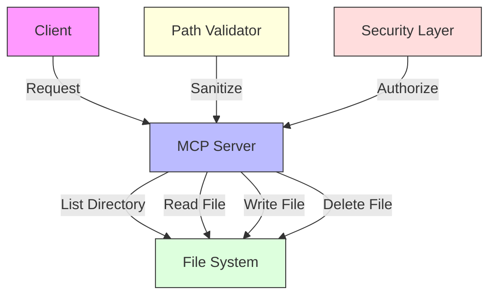
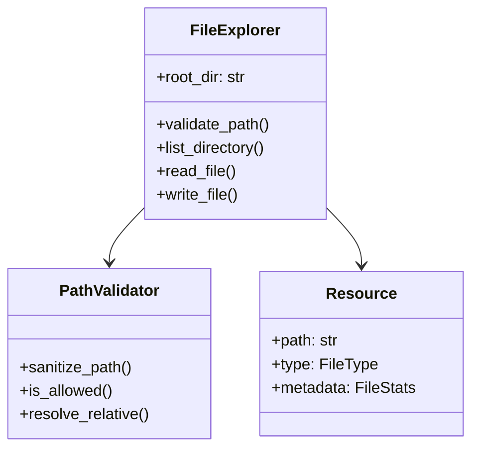

# File Explorer MCP Server

An MCP server implementation for exploring and manipulating file systems with safety and type checking.

## Features

- File system navigation
- File content reading
- Directory listing
- File search capabilities
- Path validation and security

## Standard Installation

1. Create and activate virtual environment:
   ```bash
   uv venv
   source .venv/bin/activate  # Linux/macOS
   # On Windows: .venv\Scripts\activate
   ```

2. Install dependencies:
   ```bash
   uv sync
   ```

## Quick Run Without Installation

If you want to run this example without creating a virtual environment or permanently installing dependencies, you can use the `uv run` command:

```bash
# Run directly with dependencies specified on the command line
uv run --with modelcontextprotocol,pydantic,aiofiles src/server.py

# Alternatively, if you've added inline metadata to the script:
# uv run src/server.py
```

This creates a temporary environment, installs the dependencies, runs the script, and cleans up afterward - perfect for trying out examples without cluttering your system.

To add inline metadata to the script, add these lines to the top of `src/server.py`:

```python
# /// script
# dependencies = [
#   "modelcontextprotocol>=1.10.0",
#   "pydantic>=2.0.0",
#   "aiofiles>=0.8.0", 
# ]
# ///
```

## Usage

1. Start the server:
   ```bash
   uv run src/server.py
   ```

2. The server will listen on `localhost:8000` by default

3. Example request:
   ```python
   import requests
   import json

   response = requests.post(
       "http://localhost:8000/list",
       json={"path": "/some/directory"}
   )
   print(json.dumps(response.json(), indent=2))
   ```

## API Reference

### POST /list

Lists directory contents.

**Request Body:**
```json
{
    "path": "string"
}
```

**Response:**
```json
{
    "status": "success",
    "files": [
        {
            "name": "string",
            "type": "file|directory",
            "size": "number"
        }
    ]
}
```

### POST /read

Reads file contents.

**Request Body:**
```json
{
    "path": "string"
}
```

**Response:**
```json
{
    "status": "success",
    "content": "string"
}
```

## Development

1. Install development dependencies:
   ```bash
   # Dependencies are defined in pyproject.toml
   uv sync --dev
   ```

2. Run tests:
   ```bash
   uv run pytest tests/
   ```

3. Format code:
   ```bash
   uv run black src/ tests/
   ```

4. Run type checker:
   ```bash
   uv run mypy src/
   ```

## Project Structure

```
01-file-explorer/
├── src/
│   └── server.py       # Main server implementation
├── tests/
│   └── test_server.py  # Server tests
├── resources/          # Test files for examples
└── pyproject.toml      # Project configuration with dependencies
```

## Security Considerations

- Path traversal protection
- Read-only operations by default
- Configurable root directory
- Permission validation

## Learning Objectives

- Build a file system explorer using MCP
- Learn to handle dynamic resources and paths
- Implement file operations as MCP tools
- Understand security and path validation
- Master error handling and edge cases

## Prerequisites

- Completed 00-hello-world project
- Python file system API knowledge
- Understanding of path manipulation
- Basic security concepts

## Architecture



## Key Concepts

1. **Path Resolution**
   - Absolute 'vs' relative paths
   - Path traversal prevention
   - Working directory context
   - Common pitfall: Unsanitized paths

2. **File Operations**
   - Reading directory contents
   - File metadata handling
   - Streaming large files
   - Common pitfall: Blocking operations

3. **Security Considerations**
   - Path validation
   - Access control
   - Resource limits
   - Common pitfall: Directory traversal

## Implementation Details



## Quick Start

```bash
# Initialize virtual environment
uv venv
source .venv/bin/activate

# Install dependencies
uv sync

# Run the server
uv run src/server.py

# Test with a directory
curl "http://localhost:8000/list" -d '{"path":"/tmp"}'
```

## Step-by-Step Guide

1. Path Validation Setup
   ```python
   class PathValidator:
       def __init__(self, root_dir):
           self.root_dir = root_dir
       
       def sanitize_path(self, path):
           normalized = os.path.normpath(path)
           if '..' in normalized:
               raise ValueError('Path traversal not allowed')
           return normalized
   ```
   - Prevents directory traversal
   - Normalizes paths for consistency

2. Directory Listing Resource
   ```python
   @server.resource("directory")
   async def directory_resource(uri):
       path = validator.sanitize_path(uri.query.get('path'))
       entries = []
       
       async with aiofiles.os.scandir(path) as it:
           async for entry in it:
               is_dir = await aiofiles.os.path.isdir(entry.path)
               entries.append({
                   "name": entry.name,
                   "type": "directory" if is_dir else "file",
                   "path": os.path.join(path, entry.name)
               })
       
           return {
           "contents": entries
       }
   ```
   - Lists directory contents
   - Includes file metadata
   - Handles errors gracefully

3. File Operations Tools
   ```python
   class ReadFileParams(BaseModel):
       path: str
       encoding: str = "utf-8"
   
   @server.tool("read-file")
   async def read_file_tool(params: ReadFileParams):
       valid_path = validator.sanitize_path(params.path)
       
       async with aiofiles.open(valid_path, mode='r', encoding=params.encoding) as f:
           content = await f.read()
       
           return {
           "content": [{
               "type": "text",
               "text": content
               }]
       }
   ```
   - Safe file reading
   - Encoding options
   - Error handling

## Learning Exercises

1. **Basic Exercise: Create Write Tool**
   ```python
   # Implement a tool to write files
   class WriteFileParams(BaseModel):
       path: str
       content: str
       encoding: str = "utf-8"
   
   @server.tool("write-file")
   async def write_file_tool(params: WriteFileParams):
       valid_path = validator.sanitize_path(params.path)
       
       async with aiofiles.open(valid_path, mode='w', encoding=params.encoding) as f:
           await f.write(params.content)
       
           return {
           "content": [{"type": "text", "text": "File written successfully"}]
       }
   ```

2. **Advanced Challenge: Search Tool**
   ```python
   # Implement a recursive file search tool
   class SearchFilesParams(BaseModel):
       directory: str
       pattern: str
       recursive: bool = True
   
   @server.tool("search-files")
   async def search_files_tool(params: SearchFilesParams):
       valid_path = validator.sanitize_path(params.directory)
       results = await search_files(valid_path, params.pattern, params.recursive)
       
           return {
           "content": [{
               "type": "json",
               "text": json.dumps(results)
               }]
       }
   
   async def search_files(directory, pattern, recursive):
       # Implementation of an async file search function
       results = []
       glob_pattern = f"**/{pattern}" if recursive else pattern
       
       for file_path in pathlib.Path(directory).glob(glob_pattern):
           if file_path.is_file():
               results.append(str(file_path))
       
       return results
   ```

## Troubleshooting

Common issues and solutions:
- Path error: Ensure path is within allowed directory
- Permission denied: Check file system permissions
- Memory error: Use streams for large files
- Encoding error: Verify file encoding matches content

## Best Practices

- Always validate and sanitize paths
- Use async operations for file I/O
- Implement proper error handling
- Set reasonable resource limits
- Log important operations
- Handle large files with streams

## Further Reading

- [Python aiofiles documentation](https://github.com/Tinche/aiofiles)
- [Path Traversal Prevention](https://owasp.org/www-community/attacks/Path_Traversal)
- [Python pathlib documentation](https://docs.python.org/3/library/pathlib.html)
- [File System Security Best Practices](https://docs.python.org/3/library/os.html#files-and-directories) 