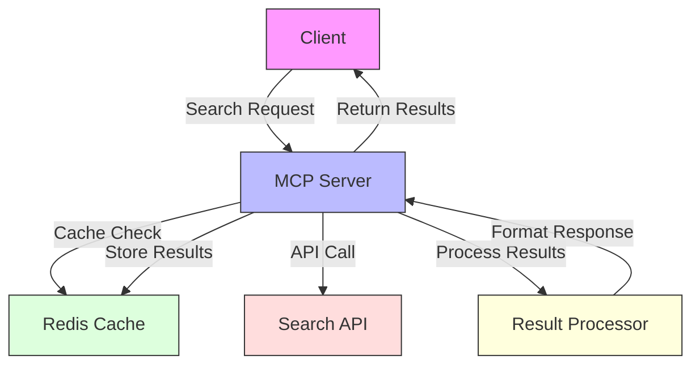
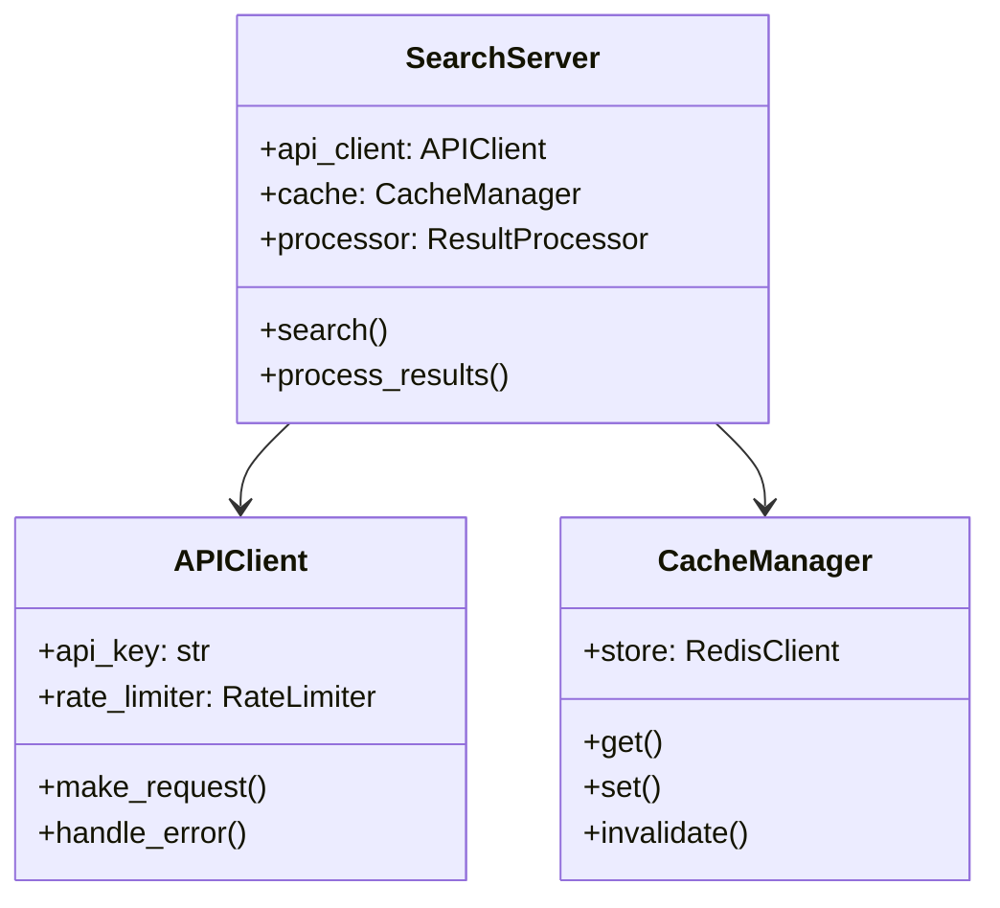

# Web Search MCP Server

An MCP server implementation that provides web search capabilities through various search engines and APIs.

## Features

- Multi-engine web search capabilities
- Structured response formatting
- Rate limiting and caching
- Type safety with Pydantic
- Configurable search parameters

## Standard Installation

1. Create and activate virtual environment:
   ```bash
   uv venv
   source .venv/bin/activate  # Linux/macOS
   # On Windows: .venv\Scripts\activate
   ```

2. Install dependencies:
   ```bash
   uv sync
   ```

## Quick Run Without Installation

If you want to run this example without creating a virtual environment or permanently installing dependencies, you can use the `uv run` command:

```bash
# Run directly with dependencies specified on the command line
uv run --with modelcontextprotocol,pydantic,aiohttp,beautifulsoup4 src/server.py

# Alternatively, if you've added inline metadata to the script:
# uv run src/server.py
```

This creates a temporary environment, installs the dependencies, runs the script, and cleans up afterward - perfect for trying out examples without cluttering your system.

To add inline metadata to the script, add these lines to the top of `src/server.py`:

```python
# /// script
# dependencies = [
#   "modelcontextprotocol>=1.10.0",
#   "pydantic>=2.0.0",
#   "aiohttp>=3.8.0",
#   "beautifulsoup4>=4.12.0", 
# ]
# ///
```

## Usage

1. Start the server:
   ```bash
   uv run src/server.py
   ```

2. The server will listen on `localhost:8000` by default

3. Example request:
   ```python
   import requests
   import json

   response = requests.post(
       "http://localhost:8000/search",
       json={"query": "Python programming language", "num_results": 5}
   )
   print(json.dumps(response.json(), indent=2))
   ```

## API Reference

### POST /search

Performs a web search.

**Request Body:**
```json
{
    "query": "string",
    "num_results": 5,
    "search_type": "web"
}
```

**Response:**
```json
{
    "status": "success",
    "results": [
        {
            "title": "string",
            "url": "string",
            "snippet": "string"
        }
    ]
}
```

## Development

1. Install development dependencies:
   ```bash
   # Dependencies are defined in pyproject.toml
   uv sync --dev
   ```

2. Run tests:
   ```bash
   uv run pytest tests/
   ```

3. Format code:
   ```bash
   uv run black src/ tests/
   ```

4. Run type checker:
   ```bash
   uv run mypy src/
   ```

## Project Structure

```
02-web-search/
├── src/
│   ├── server.py          # Main server implementation
│   └── search_engine.py   # Search engine implementations
├── tests/
│   └── test_server.py     # Server tests
├── resources/             # Example search results
└── pyproject.toml         # Project configuration with dependencies
```

## API Integration

- Uses HTTP client to query search engines
- Parses and normalizes results from different providers
- Handles API keys and authentication where needed

## Learning Objectives

- Build a web search API using MCP
- Learn to integrate with external services
- Implement response formatting and error handling
- Understand rate limiting and caching strategies
- Process and structure search results

## Prerequisites

- Completed 00-hello-world and 01-file-explorer projects
- Understanding of HTTP and REST APIs
- Knowledge of async/await patterns
- Familiarity with JSON processing

## Architecture



## Key Concepts

1. **API Integration**
   - Authentication and API keys
   - Rate limiting strategies
   - Error handling and retries
   - Common pitfall: Exposed credentials

2. **Caching**
   - Cache strategies
   - TTL management
   - Cache invalidation
   - Common pitfall: Stale data

3. **Result Processing**
   - Response transformation
   - Content filtering
   - Relevance scoring
   - Common pitfall: Large payloads

## Implementation Details



## Quick Start

```bash
# Initialize virtual environment
uv venv
source .venv/bin/activate

# Install dependencies
uv sync

# Set up environment
cp .env.example .env
# Edit .env with your API keys

# Run the server
uv run src/server.py
```

## Client Prompts

### Claude Desktop
```text
# Basic Search
Search for recent news about AI advancements.
Find research papers on quantum computing.
Look up recipes for vegan pasta dishes.

# Advanced Search
Search with date range: AI news from last week.
Search with filters: Python tutorials, beginner level.
Multi-source search: Compare AI news from different outlets.

# Cache Operations
Show cached results for "quantum computing".
Clear search cache for specific query.
View cache statistics.
```

### VSCode
```text
# Search Commands
.search query="AI news" days=7
.search query="Python tutorials" filter="beginner"
.search query="vegan pasta" sources=["cooking","food"]

# Cache Commands
.cache show query="quantum computing"
.cache clear query="AI news"
.cache stats

# System Commands
.system status
.system metrics
.system reset
```

## Step-by-Step Guide

1. API Client Setup
   ```python
   class APIClient:
       def __init__(self, api_key):
           self.api_key = api_key
           self.rate_limiter = RateLimiter(
               max_requests=60,
               per_minute=1
           )
       
       async def search(self, query):
           await self.rate_limiter.wait_for_slot()
           
           async with aiohttp.ClientSession() as session:
               async with session.get(
                   f"https://api.search.com/v1/search?q={urllib.parse.quote(query)}",
                   headers={"Authorization": f"Bearer {self.api_key}"}
               ) as response:
                   return await self.handle_response(response)
   ```
   - Handles authentication
   - Implements rate limiting
   - Manages API requests

2. Cache Implementation
   ```python
   class CacheManager:
       def __init__(self, redis_url):
           self.client = redis.Redis.from_url(redis_url)
       
       async def get(self, key):
           cached = await self.client.get(key)
           return json.loads(cached) if cached else None
       
       async def set(self, key, value, ttl_seconds=3600):
           await self.client.setex(
               key,
               ttl_seconds,
               json.dumps(value)
           )
   ```
   - Redis integration
   - TTL management
   - JSON serialization

3. Search Resource
   ```python
   @server.resource("search")
   async def search_resource(uri):
       query = uri.query.get('q')
       cached = await cache.get(query)
       
       if cached:
           return {"contents": cached}
       
       results = await api_client.search(query)
       await cache.set(query, results)
       
       return {
           "contents": [
               {
                   "title": result["title"],
                   "url": result["url"],
                   "snippet": result["snippet"]
               }
               for result in results
           ]
       }
   ```
   - Caches results
   - Handles API integration
   - Formats response

## Learning Exercises

1. **Basic Exercise: Add Image Search**
   ```python
   # Implement image search functionality
   class ImageSearchParams(BaseModel):
       query: str
       size: Literal["small", "medium", "large"] = "medium"
       type: Literal["photo", "illustration", "vector"] = "photo"
   
   @server.tool("image-search")
   async def image_search_tool(params: ImageSearchParams):
       results = await api_client.image_search(
           params.query, 
           size=params.size,
           type=params.type
       )
       
       return {
           "content": [{
               "type": "json",
               "text": json.dumps(results)
           }]
       }
   ```

2. **Advanced Challenge: Multi-Source Search**
   ```python
   # Implement parallel search across multiple APIs
   class MultiSearchParams(BaseModel):
       query: str
       sources: List[Literal["web", "news", "images"]]
       timeout: int = 5000
   
   @server.tool("multi-search")
   async def multi_search_tool(params: MultiSearchParams):
       search_tasks = [
           api_client.search(params.query, source) 
           for source in params.sources
       ]
       
       try:
           results = await asyncio.wait_for(
               asyncio.gather(*search_tasks),
               timeout=params.timeout/1000
           )
       except asyncio.TimeoutError:
           raise TimeoutError("Search timeout exceeded")
       
       return {
           "content": [{
               "type": "json",
               "text": json.dumps(results)
           }]
       }
   ```

## Troubleshooting

Common issues and solutions:
- API Rate Limit: Implement exponential backoff
- Cache Miss: Check TTL settings
- Timeout: Adjust request timeouts
- Invalid API Key: Verify environment variables

## Best Practices

- Never commit API keys
- Implement proper rate limiting
- Cache frequently accessed data
- Handle API errors gracefully
- Log API response times
- Monitor cache hit rates

## Further Reading

- [Rate Limiting Algorithms](https://konghq.com/blog/how-to-design-a-scalable-rate-limiting-algorithm)
- [Redis Caching Strategies](https://redis.io/docs/manual/patterns/caching/)
- [HTTP Best Practices](https://developer.mozilla.org/en-US/docs/Web/HTTP/Best_Practices)
- [API Security Guidelines](https://owasp.org/www-project-api-security/) 