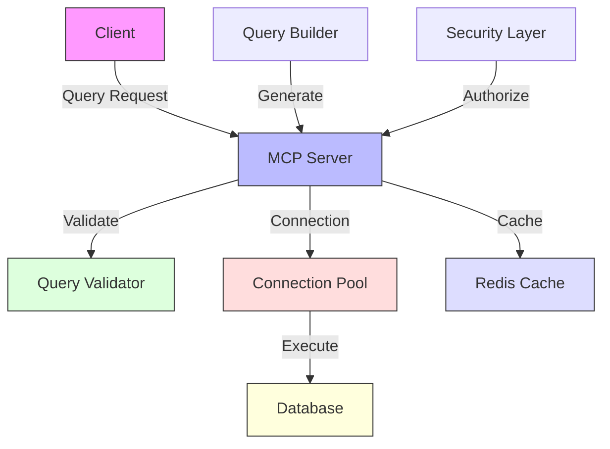
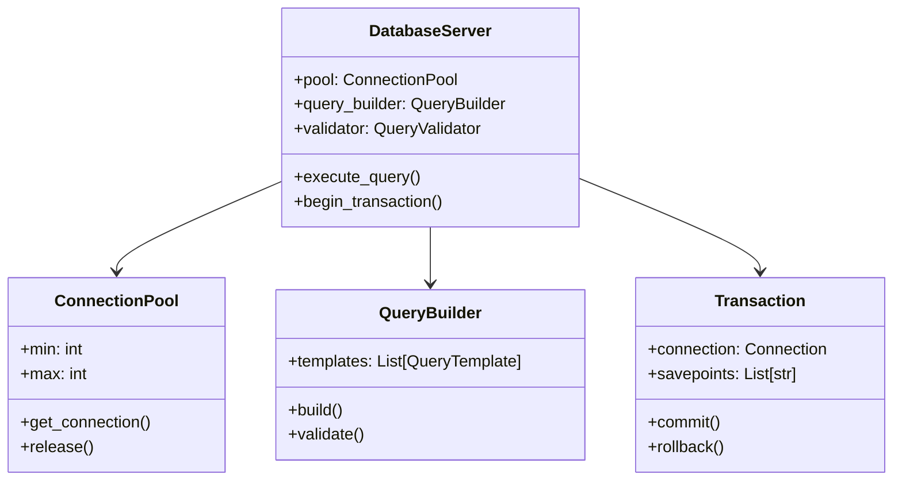

# Database Query MCP Server

An MCP server implementation that provides SQL database query capabilities with built-in safety and validation.

## Features

- Parameterized SQL query execution
- Multiple database support (SQLite, PostgreSQL)
- SQL injection prevention
- Schema introspection
- Query validation and safety checks

## Standard Installation

1. Create and activate virtual environment:
   ```bash
   uv venv
   source .venv/bin/activate  # Linux/macOS
   # On Windows: .venv\Scripts\activate
   ```

2. Install dependencies:
   ```bash
   uv sync
   ```

## Quick Run Without Installation

If you want to run this example without creating a virtual environment or permanently installing dependencies, you can use the `uv run` command:

```bash
# Run directly with dependencies specified on the command line
uv run --with modelcontextprotocol,pydantic,sqlalchemy,psycopg2-binary src/server.py

# Alternatively, if you've added inline metadata to the script:
# uv run src/server.py
```

This creates a temporary environment, installs the dependencies, runs the script, and cleans up afterward - perfect for trying out examples without cluttering your system.

To add inline metadata to the script, add these lines to the top of `src/server.py`:

```python
# /// script
# dependencies = [
#   "modelcontextprotocol>=1.10.0",
#   "pydantic>=2.0.0",
#   "sqlalchemy>=2.0.0",
#   "psycopg2-binary>=2.9.0",
# ]
# ///
```

## Usage

1. Start the server:
   ```bash
   uv run src/server.py
   ```

2. The server will listen on `localhost:8000` by default

3. Example request:
   ```python
   import requests
   import json

   response = requests.post(
       "http://localhost:8000/query",
       json={
           "query": "SELECT * FROM users WHERE username = :username",
           "params": {"username": "john_doe"},
           "database_url": "sqlite:///example.db"
       }
   )
   print(json.dumps(response.json(), indent=2))
   ```

## API Reference

### POST /query

Executes a SQL query against the specified database.

**Request Body:**
```json
{
    "query": "SELECT * FROM users WHERE username = :username",
    "params": {"username": "john_doe"},
    "database_url": "sqlite:///example.db"
}
```

**Response:**
```json
{
    "status": "success",
    "results": [
        {"id": 1, "username": "john_doe", "email": "john@example.com"}
    ],
    "columns": ["id", "username", "email"],
    "row_count": 1
}
```

### POST /schema

Retrieves the database schema.

**Request Body:**
```json
{
    "database_url": "sqlite:///example.db"
}
```

**Response:**
```json
{
    "status": "success",
    "tables": [
        {
            "name": "users",
            "columns": [
                {"name": "id", "type": "INTEGER", "primary_key": true},
                {"name": "username", "type": "VARCHAR", "primary_key": false},
                {"name": "email", "type": "VARCHAR", "primary_key": false}
            ]
        }
    ]
}
```

## Development

1. Install development dependencies:
   ```bash
   # Dependencies are defined in pyproject.toml
   uv sync --dev
   ```

2. Run tests:
   ```bash
   uv run pytest tests/
   ```

3. Format code:
   ```bash
   uv run black src/ tests/
   ```

4. Run type checker:
   ```bash
   uv run mypy src/
   ```

## Project Structure

```
03-database-query/
├── src/
│   ├── server.py        # Main server implementation
│   ├── db_manager.py    # Database connection and query handling
│   └── validators.py    # SQL validation and safety checks
├── tests/
│   └── test_server.py   # Server tests
├── resources/           # Example databases and schemas
└── pyproject.toml       # Project configuration with dependencies
```

## Security Considerations

- All queries use parameterized statements to prevent SQL injection
- Query validation prevents dangerous operations (DROP, DELETE without WHERE, etc.)
- Connection strings are validated before use
- Table and column access can be restricted for additional safety

## Learning Objectives

- Build a database query API using MCP
- Implement secure database interactions
- Work with multiple database systems
- Understand SQL injection prevention techniques
- Create effective parameter validation

## Prerequisites

- Completed previous projects (00-02)
- SQL fundamentals
- Database design principles
- Basic security concepts
- Python async patterns

## Architecture



## Key Concepts

1. **Database Access**
   - Connection pooling
   - Query optimization
   - Transaction management
   - Common pitfall: Resource leaks

2. **Query Building**
   - Safe query construction
   - Parameter validation
   - Result formatting
   - Common pitfall: SQL injection

3. **Data Security**
   - Access control
   - Data sanitization
   - Audit logging
   - Common pitfall: Over-privileged access

## Implementation Details



## Quick Start

```bash
# Initialize virtual environment
uv venv
source .venv/bin/activate

# Install dependencies
uv sync

# Set up database
cp .env.example .env
# Edit .env with your database credentials

# Run migrations
uv run -m alembic upgrade head

# Start the server
uv run src/server.py
```

## Client Prompts

### Claude Desktop
```text
# Query Operations
Show all users in the system.
Find transactions above $1000.
List inactive accounts from last month.

# Data Management
Create new user with name "John Doe".
Update email for user id 123.
Delete inactive accounts.

# Advanced Queries
Show user activity trends by month.
Find suspicious transactions patterns.
Generate monthly revenue report.
```

### VSCode
```text
# Basic Queries
.query select="users" where="status='active'"
.query select="transactions" where="amount>1000"
.query select="accounts" where="last_login<now()-30d"

# Data Commands
.data create table="users" values={name:"John",email:"john@example.com"}
.data update table="users" where="id=123" set={email:"new@email.com"}
.data delete table="accounts" where="status='inactive'"

# System Commands
.system pool-status
.system query-stats
.system cache-clear
```

## Step-by-Step Guide

1. Connection Pool Setup
   ```python
   class ConnectionPool:
       def __init__(self, config):
           self.pool = sqlalchemy.create_engine(
               config["database_url"],
               pool_size=config.get("min_connections", 2),
               max_overflow=config.get("max_connections", 10) - config.get("min_connections", 2),
               pool_pre_ping=True
           )
           
           self.setup_hooks()
       
       def setup_hooks(self):
           @event.listens_for(self.pool, 'connect')
           def on_connect(dbapi_connection, connection_record):
               dbapi_connection.execute('SET search_path TO app_schema')

       async def get_connection(self):
           return ManagedConnection(await self.pool.connect())
   ```
   - Efficient connection management
   - Automatic cleanup
   - Connection configuration

2. Query Builder Implementation
   ```python
   class QueryBuilder:
       def __init__(self, templates):
           self.templates = templates
           self.sql_injection_regex = re.compile(r'[\\/"\';\-]')
       
       def build(self, template, params):
           self.validate_params(params)
           
           # SQLAlchemy already handles parameter substitution safely
           return sqlalchemy.text(template), params
       
       def validate_params(self, params):
           for key, value in params.items():
               if isinstance(value, str) and self.sql_injection_regex.search(value):
                   raise ValueError(f"Invalid character in parameter {key}")
   ```
   - Safe parameter binding
   - SQL injection prevention
   - Query templating

3. Database Resource
   ```python
   @server.resource("query")
   async def query_resource(uri):
       query_name = uri.query.get('name')
       params = json.loads(uri.query.get('params', '{}'))
       
       template = query_builder.get_template(query_name)
       query, params = query_builder.build(template, params)
       
       async with pool.get_connection() as connection:
           result = await connection.execute(query, params)
           rows = await result.fetchall()
           
               return {
               "contents": [{
                   "type": "json",
                   "text": json.dumps([dict(row) for row in rows])
                   }]
           }
   ```
   - Resource pooling
   - Error handling
   - Result formatting

## Learning Exercises

1. **Basic Exercise: Transaction Tool**
   ```python
   # Implement a transaction management tool
   class TransactionParams(BaseModel):
       operations: List[Dict[str, Any]]
       isolation: Literal["READ COMMITTED", "REPEATABLE READ", "SERIALIZABLE"] = "READ COMMITTED"
   
   @server.tool("transaction")
   async def transaction_tool(params: TransactionParams):
       async with pool.get_connection() as connection:
           try:
               await connection.execute(f"BEGIN TRANSACTION ISOLATION LEVEL {params.isolation}")
               
               results = []
               for op in params.operations:
                   query, op_params = query_builder.build(op["query"], op["params"])
                   result = await connection.execute(query, op_params)
                   results.append(await result.fetchall())
               
               await connection.execute("COMMIT")
               return {
                   "content": [{
                       "type": "json",
                       "text": json.dumps([
                           [dict(row) for row in result]
                           for result in results
                       ])
                   }]
               }
           except Exception as e:
               await connection.execute("ROLLBACK")
               raise e
   ```

2. **Advanced Challenge: Query Analyzer**
   ```python
   # Implement a query performance analyzer
   class QueryAnalyzerParams(BaseModel):
       query: str
       params: Dict[str, Any]
       explain: bool = True
   
   @server.tool("analyze-query")
   async def analyze_query_tool(params: QueryAnalyzerParams):
       async with pool.get_connection() as connection:
           query, query_params = query_builder.build(params.query, params.params)
           analysis = await connection.execute(
               f"EXPLAIN ANALYZE {query.text}", 
               query_params
           )
           
           analysis_rows = await analysis.fetchall()
           metrics = parse_explain_output(analysis_rows)
           
               return {
               "content": [{
                   "type": "json",
                   "text": json.dumps({
                       "plan": metrics["execution_plan"],
                       "cost": metrics["total_cost"],
                       "actual_time": metrics["execution_time"],
                       "recommendations": generate_optimization_tips(metrics)
                       })
                   }]
           }
   
   def parse_explain_output(rows):
       # Implementation of explain output parser
       pass
   
   def generate_optimization_tips(metrics):
       # Implementation of optimization recommendation generator
       pass
   ```

## Troubleshooting

Common issues and solutions:
- Connection timeout: Check pool configuration
- Query timeout: Review query performance
- Pool exhaustion: Monitor connection usage
- Transaction deadlock: Analyze lock patterns

## Best Practices

- Use connection pooling
- Implement proper transaction isolation
- Never concatenate SQL strings
- Log slow queries
- Set appropriate timeouts
- Monitor pool metrics
- Regular query optimization

## Further Reading

- [SQLAlchemy Documentation](https://docs.sqlalchemy.org/)
- [SQL Injection Prevention](https://cheatsheetseries.owasp.org/cheatsheets/SQL_Injection_Prevention_Cheat_Sheet.html)
- [Transaction Isolation Levels](https://www.postgresql.org/docs/current/transaction-iso.html)
- [Database Connection Pooling](https://docs.sqlalchemy.org/en/20/core/pooling.html) 