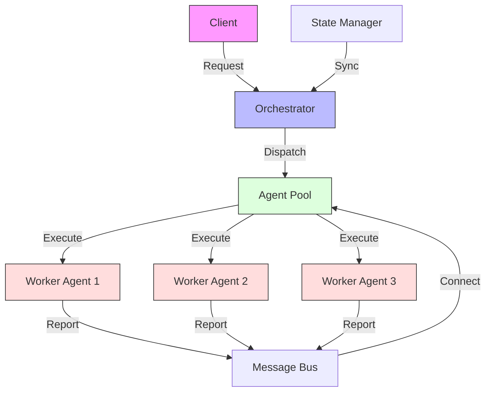
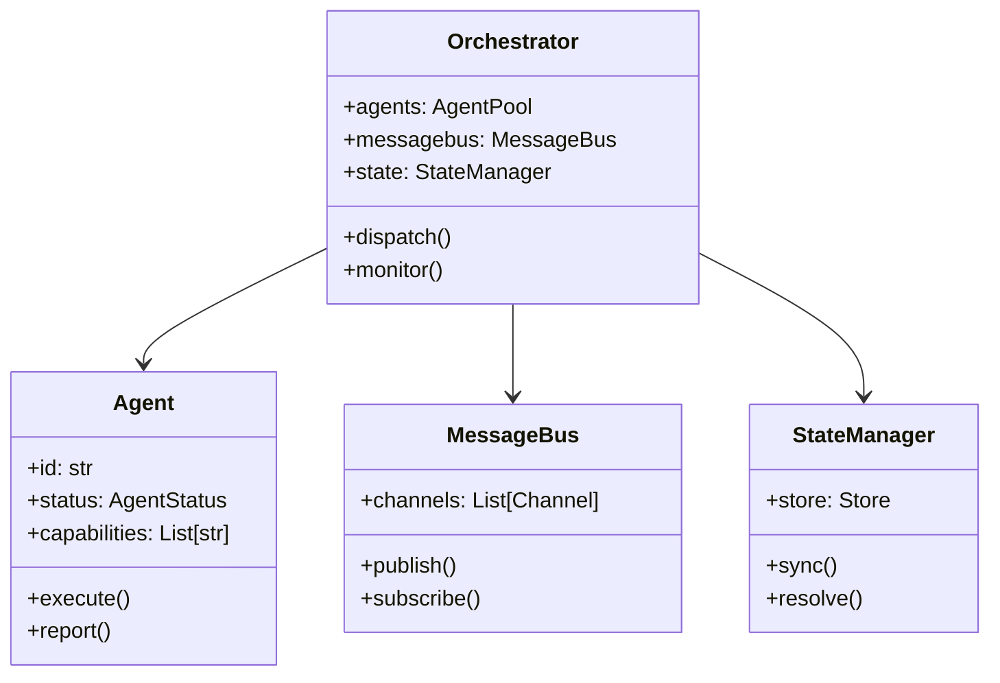

# Agent System MCP Server

An MCP server implementation that allows AI agents to interact with a task management system, providing coordinated problem-solving capabilities.

## Features

- Multi-agent orchestration
- Task creation, assignment, and tracking
- Agent-to-agent communication
- Skill and capability registration
- Structured knowledge sharing

## Standard Installation

1. Create and activate virtual environment:
   ```bash
   uv venv
   source .venv/bin/activate  # Linux/macOS
   # On Windows: .venv\Scripts\activate
   ```

2. Install dependencies:
   ```bash
   uv sync
   ```

## Quick Run Without Installation

If you want to run this example without creating a virtual environment or permanently installing dependencies, you can use the `uv run` command:

```bash
# Run directly with dependencies specified on the command line
uv run --with modelcontextprotocol,pydantic,fastapi,uvicorn src/server.py

# Alternatively, if you've added inline metadata to the script:
# uv run src/server.py
```

This creates a temporary environment, installs the dependencies, runs the script, and cleans up afterward - perfect for trying out examples without cluttering your system.

To add inline metadata to the script, add these lines to the top of `src/server.py`:

```python
# /// script
# dependencies = [
#   "modelcontextprotocol>=1.10.0",
#   "pydantic>=2.0.0",
#   "fastapi>=0.104.0",
#   "uvicorn>=0.23.0",
# ]
# ///
```

## Usage

1. Start the server:
   ```bash
   uv run src/server.py
   ```

2. The server will listen on `localhost:8000` by default

3. Example request to create a task:
   ```python
   import requests
   import json

   response = requests.post(
       "http://localhost:8000/tasks",
       json={
           "title": "Research quantum computing",
           "description": "Compile information about recent advances in quantum computing",
           "priority": "high",
           "required_skills": ["research", "technical_writing"]
       }
   )
   print(json.dumps(response.json(), indent=2))
   ```

## API Reference

### POST /tasks

Creates a new task in the system.

**Request Body:**
```json
{
    "title": "Research quantum computing",
    "description": "Compile information about recent advances in quantum computing",
    "priority": "high",
    "required_skills": ["research", "technical_writing"]
}
```

**Response:**
```json
{
    "status": "success",
    "task_id": "task_12345",
    "message": "Task created successfully"
}
```

### POST /agents

Registers a new agent with the system.

**Request Body:**
```json
{
    "agent_id": "research_agent_1",
    "name": "Research Assistant",
    "skills": ["research", "data_analysis", "technical_writing"],
    "availability": "full"
}
```

**Response:**
```json
{
    "status": "success",
    "agent_id": "research_agent_1",
    "message": "Agent registered successfully"
}
```

### POST /assign

Assigns a task to an agent.

**Request Body:**
```json
{
    "task_id": "task_12345",
    "agent_id": "research_agent_1"
}
```

**Response:**
```json
{
    "status": "success",
    "task_id": "task_12345",
    "agent_id": "research_agent_1",
    "message": "Task assigned successfully"
}
```

### POST /messages

Sends a message between agents.

**Request Body:**
```json
{
    "sender_id": "research_agent_1",
    "recipient_id": "writing_agent_2",
    "content": "I've completed the research on quantum computing. Here are my findings.",
    "related_task_id": "task_12345"
}
```

**Response:**
```json
{
    "status": "success",
    "message_id": "msg_67890",
    "timestamp": "2023-11-15T14:30:45Z"
}
```

## Development

1. Install development dependencies:
   ```bash
   # Dependencies are defined in pyproject.toml
   uv sync --dev
   ```

2. Run tests:
   ```bash
   uv run pytest tests/
   ```

3. Format code:
   ```bash
   uv run black src/ tests/
   ```

4. Run type checker:
   ```bash
   uv run mypy src/
   ```

## Project Structure

```
04-agent-system/
├── src/
│   ├── server.py         # Main server implementation
│   ├── agent_manager.py  # Agent registration and capability tracking
│   ├── task_manager.py   # Task creation and assignment logic
│   └── message_broker.py # Inter-agent communication system
├── tests/
│   └── test_server.py    # Server tests
└── resources/            # Example configurations and templates
```

## Learning Objectives

- Design and implement a multi-agent coordination system
- Create effective task distribution algorithms
- Build structured agent-to-agent communication
- Implement skill matching and capability tracking
- Develop task lifecycle management

## Prerequisites

- Completed previous projects (00-03)
- Distributed systems concepts
- Message passing patterns
- State management principles
- Error handling strategies

## Architecture



## Key Concepts

1. **Agent Architecture**
   - Agent lifecycle
   - State management
   - Communication protocols
   - Common pitfall: State inconsistency

2. **Task Orchestration**
   - Task distribution
   - Progress tracking
   - Error recovery
   - Common pitfall: Dead agents

3. **Message Passing**
   - Message formats
   - Routing strategies
   - Queue management
   - Common pitfall: Message loss

## Implementation Details



## Quick Start

```bash
# Initialize virtual environment
uv venv
source .venv/bin/activate

# Install dependencies
uv sync

# Set up environment
cp .env.example .env
# Edit .env with your configuration

# Start the system
uv run src/server.py
```

## Client Prompts

### Claude Desktop
```text
# Agent Operations
Create new agent for data processing.
Assign task to agent "worker-1".
Check status of all agents.

# Task Management
Submit task to process customer data.
Monitor task progress.
Cancel running task.

# System Control
Scale agent pool to 5 workers.
Pause all agents.
Resume agent operations.
```

### VSCode
```text
# Agent Commands
.agent create type="processor" name="worker-1"
.agent assign task="process-data" to="worker-1"
.agent status all

# Task Commands
.task submit id="process-123" data={type:"customer",action:"analyze"}
.task status id="process-123"
.task cancel id="process-123"

# System Commands
.system scale workers=5
.system pause all
.system resume all
```

## Step-by-Step Guide

1. Agent Implementation
   ```python
   class Agent:
       def __init__(self, id, capabilities):
           self.id = id
           self.capabilities = capabilities
           self.status = AgentStatus.IDLE
           self.message_queue = Queue()

       async def execute(self, task):
           self.status = AgentStatus.BUSY
           try:
               result = await self.process_task(task)
               await self.message_queue.publish('task.complete', {
                   'agent_id': self.id,
                   'task_id': task.id,
                   'result': result
               })
               return result
           except Exception as error:
               await self.message_queue.publish('task.error', {
                   'agent_id': self.id,
                   'task_id': task.id,
                   'error': str(error)
               })
               raise error
           finally:
               self.status = AgentStatus.IDLE
   ```
   - Lifecycle management
   - Error handling
   - Status reporting

2. Message Bus Setup
   ```python
   class MessageBus:
       def __init__(self):
           self.channels = {}
           self.handlers = {}
       
       async def publish(self, channel, message):
           if channel not in self.channels:
               self.channels[channel] = []
           
           self.channels[channel].append({
               'timestamp': time.time(),
               'payload': message
           })
           
           handlers = self.handlers.get(channel, [])
           for handler in handlers:
               await handler(message)
       
       def subscribe(self, channel, handler):
           if channel not in self.handlers:
               self.handlers[channel] = []
           
           self.handlers[channel].append(handler)
           
           def unsubscribe():
               return self.unsubscribe(channel, handler)
           
           return unsubscribe
   ```
   - Channel management
   - Message routing
   - Subscription handling

3. Orchestrator Implementation
   ```python
   class Orchestrator:
       def __init__(self, config):
           self.agent_pool = AgentPool(config.get('pool_size', 5))
           self.message_bus = MessageBus()
           self.state_manager = StateManager()
           
           self.message_bus.subscribe('task.complete', 
               self.handle_task_complete)
           self.message_bus.subscribe('task.error', 
               self.handle_task_error)

       async def dispatch(self, task):
           agent = await self.agent_pool.find_available(task.requirements)
           if not agent:
               raise ValueError('No available agent')
           
           self.state_manager.track_task(task, agent)
           return await agent.execute(task)
   ```
   - Task distribution
   - Agent coordination
   - State tracking

## Learning Exercises

1. **Basic Exercise: Load Balancer**
   ```python
   # Implement a smart load balancer for agents
   class LoadBalancer:
       def __init__(self, agent_pool):
           self.pool = agent_pool
           self.metrics = {}

       async def select_agent(self, task):
           available = await self.pool.get_available()
           best_agent = None
           best_metric = 0
           
           for agent in available:
               metric = self.calculate_metric(agent)
               if not best_agent or metric > best_metric:
                   best_agent = agent
                   best_metric = metric
           
           return best_agent
       
       def calculate_metric(self, agent):
           metrics = self.metrics.get(agent.id, {
               'success_rate': 1.0,
               'avg_processing_time': 0.1,
               'last_used': 0
           })
           
           load = (time.time() - metrics['last_used']) / 1000
           return metrics['success_rate'] * (1 / metrics['avg_processing_time']) * load
   ```

2. **Advanced Challenge: Fault Tolerance**
   ```python
   # Implement a fault-tolerant task execution system
   class FaultTolerantExecutor:
       def __init__(self, orchestrator):
           self.orchestrator = orchestrator
           self.retry_policy = {
               'max_attempts': 3,
               'backoff': lambda attempt: 2 ** attempt * 1000
       }

       async def execute_with_retry(self, task):
           last_error = None
           
           for attempt in range(self.retry_policy['max_attempts']):
               try:
                   return await self.orchestrator.dispatch({
                       **task,
                       'attempt': attempt,
                       'deadline': time.time() + self.calculate_deadline(attempt)
                   })
               except Exception as error:
                   last_error = error
                   await asyncio.sleep(self.retry_policy['backoff'](attempt) / 1000)
           
           raise RuntimeError(f"Task failed after {self.retry_policy['max_attempts']} attempts: {last_error}")
       
       def calculate_deadline(self, attempt):
           return self.retry_policy['backoff'](attempt) * 2
   ```

## Troubleshooting

Common issues and solutions:
- Agent unresponsive: Implement heartbeat system
- Message loss: Use persistent queues
- State conflict: Implement conflict resolution
- Resource leak: Monitor agent lifecycle

## Best Practices

- Implement proper agent lifecycle
- Use persistent message queues
- Monitor system health
- Implement circuit breakers
- Log all state changes
- Handle partial failures
- Design for scalability

## Further Reading

- [Distributed Systems Patterns](https://martinfowler.com/articles/patterns-of-distributed-systems/)
- [Message Queue Design](https://www.rabbitmq.com/tutorials/amqp-concepts.html)
- [Fault Tolerance Patterns](https://docs.microsoft.com/en-us/azure/architecture/patterns/category/resiliency)
- [State Management in Distributed Systems](https://www.confluent.io/blog/how-to-build-a-distributed-state-machine/)