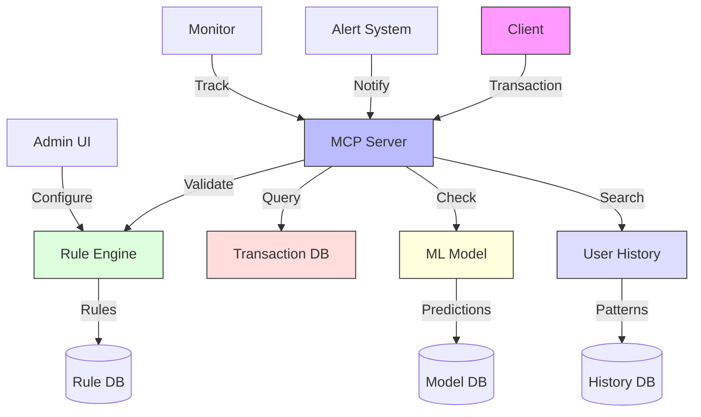

# Fraud Detection MCP Server

An MCP server implementation that analyzes financial transactions to detect potentially fraudulent activity using rule-based and machine learning approaches.

## Features

- Real-time transaction analysis
- Configurable detection rules 
- Transaction risk scoring
- Anomaly detection
- Alert generation with explanation
- Historical transaction analysis

## Installation

1. Create and activate virtual environment:
   ```bash
   uv venv
   source .venv/bin/activate  # Linux/macOS
   # On Windows: .venv\Scripts\activate
   ```

2. Install dependencies:
   ```bash
   uv sync
   ```

## Quick Run

If you want to run this example without creating a virtual environment:

```bash
# Run directly with dependencies specified on the command line
uv run --with modelcontextprotocol,pydantic,fastapi,uvicorn,pandas,numpy,scikit-learn src/server.py
```

This creates a temporary environment, installs the dependencies, runs the script, and cleans up afterward.

To add inline metadata to the script, add these lines to the top of `src/server.py`:

```python
# /// script
# dependencies = [
#   "modelcontextprotocol>=1.10.0",
#   "pydantic>=2.0.0",
#   "fastapi>=0.104.0",
#   "uvicorn>=0.23.0",
#   "pandas>=2.0.0",
#   "numpy>=1.20.0",
#   "scikit-learn>=1.0.0",
# ]
# ///
```

## Usage

1. Start the server:
   ```bash
   uv run src/server.py
   ```

2. The server will listen on `localhost:8000` by default

3. Example request to analyze a transaction:
   ```python
   import requests
   import json

   response = requests.post(
       "http://localhost:8000/analyze",
       json={
           "transaction_id": "tx_1234567890",
           "account_id": "acc_9876543210",
           "amount": 2500.00,
           "merchant": "Electronics Store XYZ",
           "timestamp": "2023-11-15T14:30:45Z",
           "location": "New York, NY",
           "payment_method": "credit_card"
       }
   )
   print(json.dumps(response.json(), indent=2))
   ```

## API Reference

### POST /analyze

Analyzes a transaction for potential fraud.

**Request Body:**
```json
{
    "transaction_id": "tx_1234567890",
    "account_id": "acc_9876543210",
    "amount": 2500.00,
    "merchant": "Electronics Store XYZ",
    "timestamp": "2023-11-15T14:30:45Z", 
    "location": "New York, NY",
    "payment_method": "credit_card"
}
```

**Response:**
```json
{
    "transaction_id": "tx_1234567890",
    "risk_score": 0.82,
    "is_fraudulent": true,
    "risk_factors": [
        "unusual_amount",
        "geographic_anomaly",
        "frequency_anomaly"
    ],
    "explanation": "This transaction has a high risk score due to an unusually large amount for this account, geographic location different from typical usage patterns, and multiple transactions in a short time period."
}
```

### POST /rules

Creates or updates a fraud detection rule.

**Request Body:**
```json
{
    "rule_id": "rule_001",
    "name": "Large Amount Rule",
    "description": "Flag transactions over a certain amount",
    "condition": {
        "field": "amount",
        "operator": "gt",
        "value": 5000
    },
    "risk_score": 0.7,
    "enabled": true
}
```

**Response:**
```json
{
    "status": "success",
    "rule_id": "rule_001",
    "message": "Rule created successfully"
}
```

### GET /rules

Retrieves all active fraud detection rules.

**Response:**
```json
{
    "rules": [
        {
            "rule_id": "rule_001",
            "name": "Large Amount Rule",
            "description": "Flag transactions over a certain amount",
            "condition": {
                "field": "amount",
                "operator": "gt",
                "value": 5000
            },
            "risk_score": 0.7,
            "enabled": true
        },
        {
            "rule_id": "rule_002",
            "name": "Frequent Transactions Rule",
            "description": "Flag accounts with many transactions in short period",
            "condition": {
                "field": "frequency",
                "operator": "gt",
                "value": 5,
                "time_window": "1h"
            },
            "risk_score": 0.6,
            "enabled": true
        }
    ]
}
```

## Development

1. Install development dependencies:
   ```bash
   uv sync --dev
   ```

2. Run tests:
   ```bash
   uv run pytest tests/
   ```

3. Format code:
   ```bash
   uv run black src/ tests/
   ```

4. Run type checker:
   ```bash
   uv run mypy src/
   ```

## Project Structure

```
05-fraud-detection/
├── src/
│   ├── server.py          # Main server implementation
│   ├── analyzer.py        # Transaction analysis engine
│   ├── rule_engine.py     # Rule-based detection system
│   ├── ml_models.py       # Machine learning model integration
│   └── data_processor.py  # Data preprocessing utilities
├── tests/
│   └── test_analyzer.py   # Analyzer tests
└── resources/             # Sample data and model files
```

## Architecture



## Key Components

1. **Rule Engine**
   - Rule definition and evaluation
   - Rule chaining
   - Avoids rule conflicts

2. **ML Integration**
   - Model serving
   - Feature engineering
   - Prediction caching
   - Handles model drift

3. **Alert System**
   - Alert levels
   - Notification routing
   - Alert aggregation
   - Prevents alert fatigue

## Implementation Examples

```python
# Rule Engine Example
class RuleEngine:
    def __init__(self, config):
        self.rules = {}
        self.rule_order = []
        self.db = Database(config.rule_db)

    async def evaluate(self, transaction):
        results = []
        for rule_id in self.rule_order:
            rule = self.rules[rule_id]
            result = await rule.evaluate(transaction)
            results.append(result)
            
            if result.action == 'BLOCK':
                return {
                    "action": "BLOCK",
                    "reason": result.reason,
                    "confidence": result.confidence
                }
        
        return self.aggregate_results(results)
```

```python
# ML Service Example
class MLService:
    def __init__(self, config):
        self.model = Model(config.model_path)
        self.feature_extractor = FeatureExtractor()
        self.cache = Cache(config.cache_config)

    async def predict(self, transaction):
        cache_key = self.get_cache_key(transaction)
        cached = await self.cache.get(cache_key)
        if cached:
            return cached

        features = await self.feature_extractor.extract(transaction)
        prediction = await self.model.predict(features)
        
        await self.cache.set(cache_key, prediction)
        return prediction
```

```python
# Alert System Example
class AlertSystem:
    def __init__(self, config):
        self.channels = {}
        self.aggregator = AlertAggregator(config.aggregation)
        self.monitor = Monitor()

    async def notify(self, alert):
        aggregated = await self.aggregator.process(alert)
        if not aggregated:
            return  # Alert was aggregated, no need to send

        channels = self.select_channels(alert.severity)
        await asyncio.gather(
            *[self._send_with_logging(channel, alert) for channel in channels]
        )
```

## Learning Exercises

1. **Custom Rule Implementation**
   ```python
   # Velocity check rule
   class VelocityRule(BaseRule):
       def __init__(self, config):
           super().__init__('velocity_check')
           self.time_window = config.time_window
           self.max_transactions = config.max_transactions
       
       async def evaluate(self, transaction):
           history = await self.get_history(
               transaction.user_id,
               self.time_window
           )
           
           if len(history) >= self.max_transactions:
               return {
                   "action": "BLOCK",
                   "reason": "Too many transactions",
                   "confidence": 0.9
               }
           
           return {
               "action": "ALLOW",
               "confidence": 1 - (len(history) / self.max_transactions)
           }
   ```

2. **Anomaly Detection Implementation**
   ```python
   class AnomalyDetector:
       def __init__(self, config):
           self.dimensions = config.dimensions
           self.threshold = config.threshold
           self.models = {}
       
       async def detect(self, transaction):
           patterns = await asyncio.gather(*[
               self._score_dimension(dimension, transaction) 
               for dimension in self.dimensions
           ])
           
           anomalies = [pattern for pattern in patterns if pattern['score'] > self.threshold]
           
           if anomalies:
               return {
                   "is_anomaly": True,
                   "patterns": anomalies,
                   "confidence": max(a['score'] for a in anomalies)
               }
           
           return {"is_anomaly": False}
   ```

## Troubleshooting

Common issues and solutions:
- High false positives: Adjust rule thresholds
- Model latency: Implement prediction caching
- Alert storms: Configure proper aggregation
- Database bottleneck: Optimize queries

## Best Practices

- Monitor rule performance and model accuracy
- Set appropriate alert thresholds
- Implement comprehensive logging
- Regular model updates
- Database optimization
- Performance monitoring

## Further Reading

- [Fraud Detection Systems](https://aws.amazon.com/solutions/implementations/fraud-detection-using-machine-learning/)
- [Rule Engine Design](https://martinfowler.com/bliki/RulesEngine.html)
- [ML in Production](https://ml-ops.org/)
- [Alert Management](https://sre.google/sre-book/monitoring-distributed-systems/) 